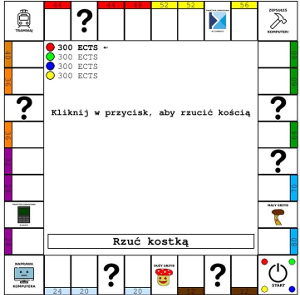

# Monopoly UWr
Projekt na PWI - gra typu Monopoly dla 4 graczy



# Wymagania
Python 3.x

# Jak uruchomić?
### Dystrybucje oparte o debiana:

```sh
sudo apt install python3 python3-pip
pip3 install matplotlib pygame
python3 src/main.py
```

# Obsługa
Gra obsługiwana jest za pomocą myszy.
